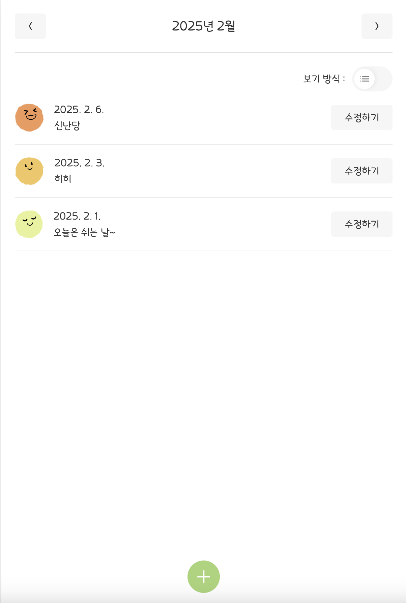
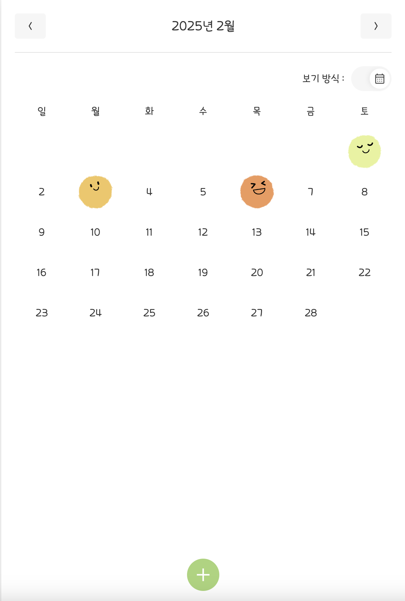
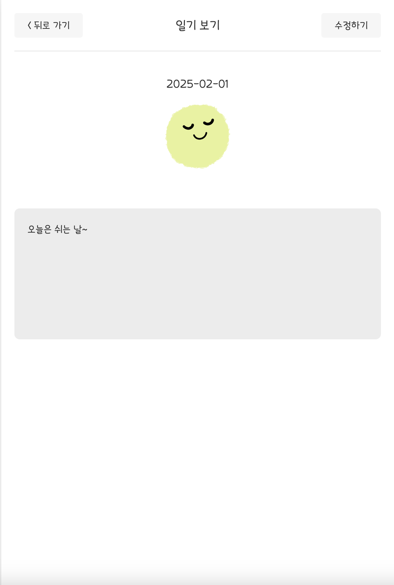
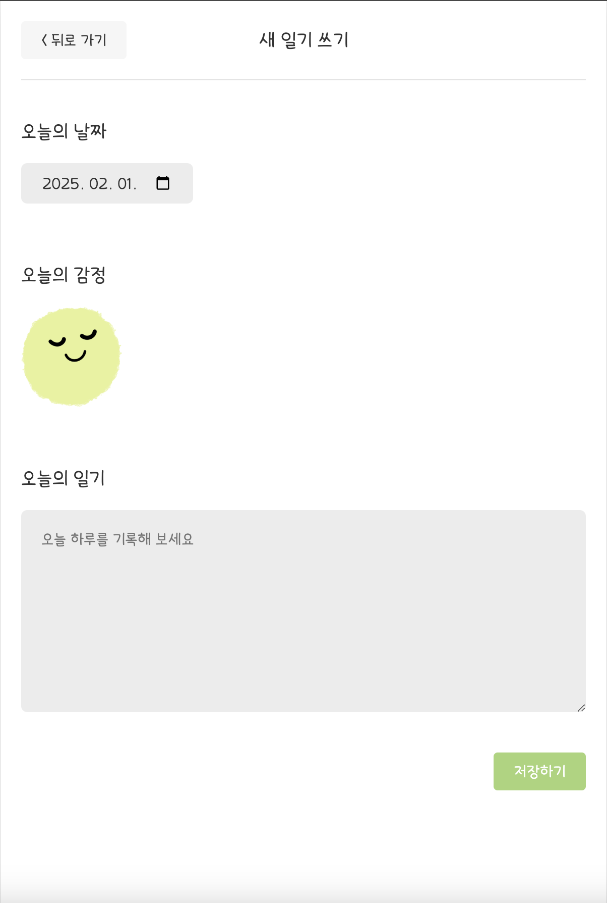

# 감정일기장

🔗 서비스 URL: https://emotion-diary-tau-henna.vercel.app/

**감정일기장**은 인프런 - 한 입 크기로 잘라 먹는 리액트 강의를 수강하며 개발한 프로젝트입니다.
일기 작성, 감정 기록, 수정 및 삭제 기능을 제공하며, 로컬 스토리지를 활용해 데이터를 저장합니다.

<br />

## ✨ 주요 기능

- **일기 작성:** 날짜 선택, 감정 이모티콘 선택, 텍스트 입력 가능
- **일기 목록 보기:** 리스트 & 캘린더 뷰 지원 (로컬 스토리지 저장)
- **일기 상세 보기:** 개별 일기 확인
- **일기 수정/삭제:** 기존 일기 수정 및 삭제 가능

<br />

## 🛠️ 기술 스택

- Frontend: React, JavaScript
- Storage: LocalStorage (브라우저 내 데이터 저장)

<br />

## 📌 주요 페이지

**1️⃣ 홈(Home) 🏠**  



- 작성한 일기를 볼 수 있는 페이지입니다.
- 리스트 보기와 캘린더 보기를 선택할 수 있습니다.

**2️⃣ 일기 상세 페이지 (Diary)**  


- 작성한 일기의 상세 페이지입니다.
- 수정하기 버튼을 통해 "Edit" 페이지로 이동하여 일기를 수정할 수 있습니다.

**3️⃣ 새 일기 작성 페이지 (New)**  


- 새 일기를 작성하는 페이지입니다.

<br />

## 📂 프로젝트 구조

```
📦 tickets
├── 📂 public
├── 📂 src
│   ├── 📂 components        # 컴포넌트
│   ├── 📂 pages             # 페이지 컴포넌트
│   ├── 📂 hooks             # 커스텀 훅
│   ├── 📂 assets            # 아이콘
│   ├── 📂 util              # 유틸 함수
│   ├── 📜 index.css         # 공통 스타일
│   └── 📜 App.jsx           # Context, Reducet, 라우트 설정
├── 📂 dist                  # 빌드된 파일
└── 📜 index.html
```
